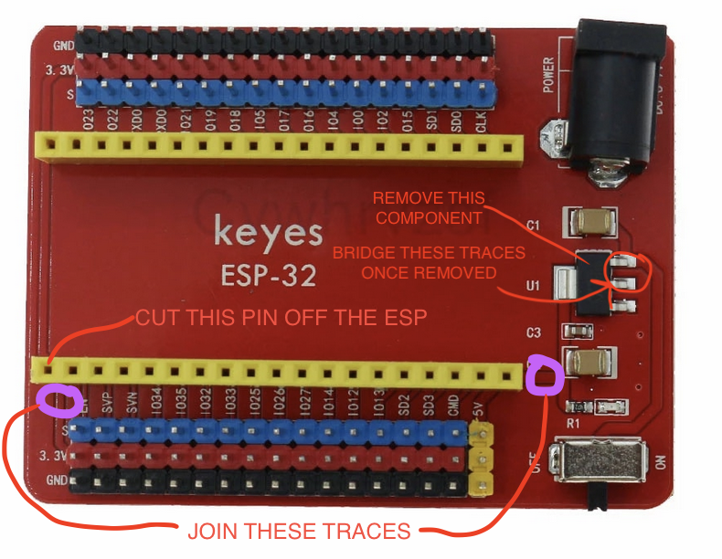
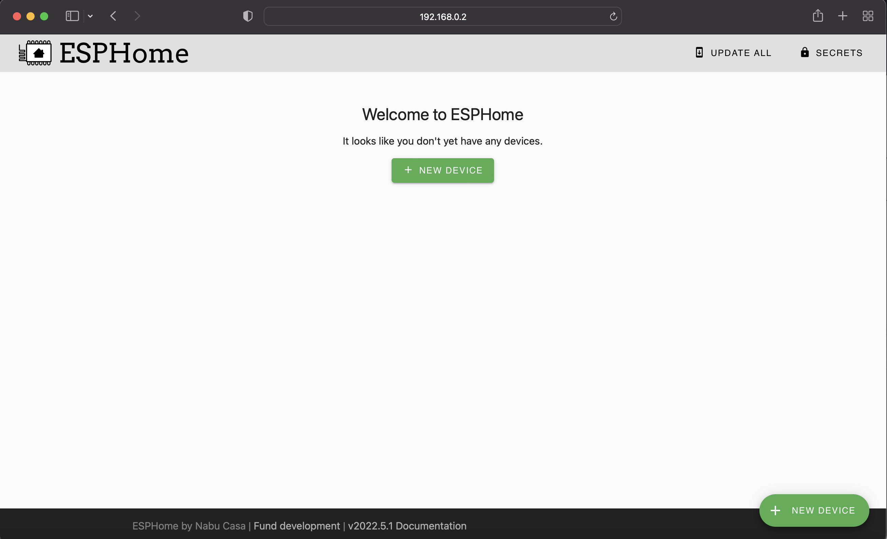
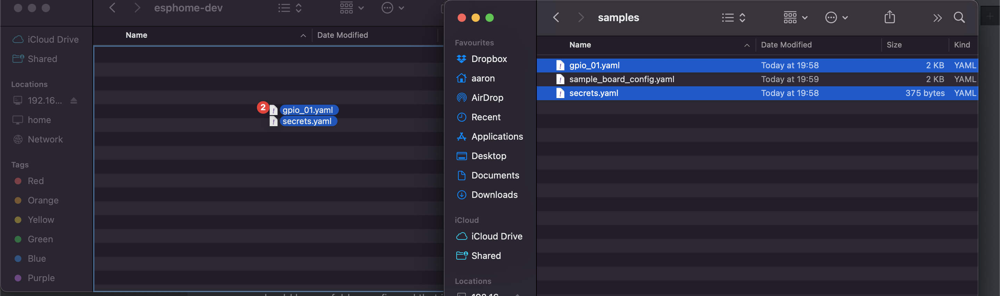
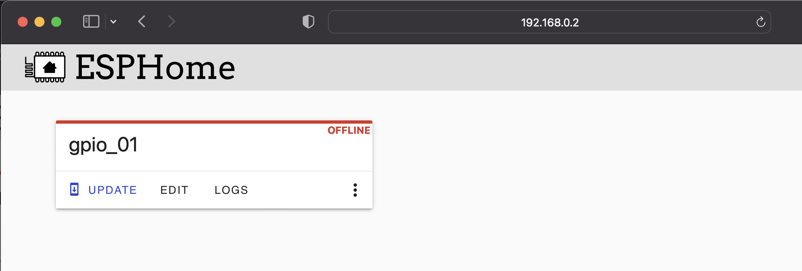

# ESPHome for Model Railroading

## Introduction

The repo is a collection of resources for using the home automation tool ESPHome with a model railroad. ESPHome is a great platform to base your automations/control systems on as it abstracts a lot of the authoring of code away from you, so you can focus on creating something that works for your use case, and know that the code running on your microcontrollers is optimised.

Currently I'm working on the following 3 use cases:

- Block Detection
- Point Control
- Signal Control

So far I've got Block Detection to the stage where it is being implemented on my layout, and Point Control will follow shortly. I have some plans to use addressable RGB LEDs for Signal Control which I'll share in this repo once i'm at that stage.

## Background

My layout is based on the Illawarra line in the early 2000's between Bomaderry/Nowra, Kiama and other areas of interest. Here's a [slide deck](https://www.dropbox.com/scl/fi/j3us5vd0bijmh6vbv1nti/The-Illawarra-Line.pptx?dl=0&rlkey=eekq5k3a9k8lqploqze55ly3p) I put together to set my vision for the layout, it's still continuing to evolve (particularly in the track plan space).

As I'm building the layout for operations, having a central control system was of utmost importance. I've previously used propietary systems such as Train-Brain by CTI Electronics, which I implemented on a [previous N Scale layout](https://steinosub.blogspot.com) and this worked quite well.

Since my discovery of Arduino and by extension ESP32/ESP8266 boards I've been trying to find a way to use them for block detection. I've done a couple of basic POCs using Arduino/Micropython ([here](https://github.com/aaron9589/block-detection-poc) and [here](https://github.com/aaron9589/IoCATS)).

## Control System

I've settled on using JMRI as the backbone for this control system purely for its [MQTT integration](https://www.jmri.org/help/en/html/hardware/mqtt/index.shtml). I'm planning on using the CATS add-on, which simplies some of the signalling logic I'd have to implement. I highly recommend the [herding cats](https://www.youtube.com/watch?v=H-P1guhnVpw&list=PLfmcarbF8DzEG9taeiSSWonbz3h6VQs3F) YouTube series, if you want learn more about CATS straight from the folks that help support it

CATS talks to JMRI through tables - and those tables are reflected through MQTT topics. This is the key integration that allows the use of ESPHome on a layout.

## Setting Up Your First ESP Board in ESPHome

### Components

- ESP32, 38 Pin: https://www.aliexpress.com/item/1005002435072060.html
- ESP32 Breakout Board: https://www.aliexpress.com/item/1005003909506324.html
- 6-12v Transformer for the ESP Power Bus (I run mine at about 7v, the onboard regulator on the breakout board drops this to 5v) - I ended up going with a variable voltage 5A power supply with amp meter so I could ensure I stayed within the threshold of the supply. I could use Buck Converters off the DCC Bus, but I wanted to keep this completely seperate to preserve the signal/servo state in the event of a short in a power district.

So you've ordered the bits, waited that arbitrary amount of time for it to materialise at your doorstep - now what?

### Modifying the Breakout Board

The board by default has a 3.3v rail down the centre breakout pin, delivered through the ESP which steps down the 5v from the board itself. I wanted 5v on this line to drive servos, LEDs, etc. I made a simple modification by **snipping the 3.3v leg on the ESP**, and running a wire from the 5v out of the regulator to a trace on the other side of the board as per the diagram below



I also drilled two holes through the centre of the board for mounting.

### Setup the supporting infrastructure

The ESPs communicate over Wifi to a MQTT server - all of this is configured in secrets.yml and referenced through the main board file using the `!secret` command. So as a bare minimum you require:

- A 2.4Ghz (not 5Ghz) Wifi network your ESPs can join with DHCP (most modem/routers have these capabilities out of the box, I use a standalone Unifi Access Point cabled to my core network)

- A computer running MQTT - http://mosquitto.org/download/ is easy to download and install.

  - Ensure that you place these lines in your **mosquitto.conf** file. You will find the **mosquitto.conf** file in the **/etc/mosquitto** directory on Linux, and in the **C:\mosquitto** directory on Windows.

    ```bash
    allow_anonymous true
    listener 1883 0.0.0.0
    ```

    this will allow connections without authentication, and allow your server to listen on all interfaces (0.0.0.0). If you're a bit paranoid about security on your home network, you can configure TLS/password authentication - more detail is available on ESPHomes [website](https://esphome.io/components/mqtt.html) - If I ever expose this for remote ops, I'll only port forward a single known IP.

- Note down your computer's IP address, and your Wifi network Name and password - you'll need it shortly.

### Setup ESPHome Dashboard

If you're not familiar with Docker or Python, this will be a bit tricky. In short, you need to setup a copy of ESPHome to run the dashboard - this makes it easy to see all your configured boards in one spot, and make any changes over the wifi once the board is registered in the dashboard. More details on the dashboard can be found [here](https://esphome.io/guides/getting_started_command_line.html#bonus-esphome-dashboard)

If you have something like a Synology NAS or other device with docker installed - pull down a copy of the esphome container (`esphome/esphome:latest`), expose port 6052 to the same port/another port of your choice (or use bridged networking) and mount a folder at /config in the container from your host.

If your container has started, navigate to http://<your-host-ip>:<your-port-you-chose> and you'll see something like this:



### Configure Your First ESPHome Board

OK now we're getting to the interesting part - the actual provisioning of a board. When you setup your ESPHome Dashboard, you should have a folder configured that is used for persistent storage. You're going to copy two files over from this repo into this folder:

	- samples/sample-board-config.yaml
	- samples/secrets.yaml



if you navigate to your ESPHome dashboard webpage and you'll see something like this:



There's your board! rename the esp32-01.yaml file to whatever you want to call your board. Once you're done, open up the file in your favourite text editor (if you're stuck - try something like atom that highlights YAML syntax)

OK now we're going to make some changes. YAML is an easier-to-read version of JSON, and is made up of key-value pairs. We're going to change a couple of these settings to suit your environment, and configure the first board.

**Note: We will configure the board initially by USB using a browser. You will require Google Chrome for the next steps**

1) Open your boards YAML file, and set the name of the board:

```yaml
esphome:
  name: myfirstboard
```

2. Open secrets.yaml, and set each of the values as per the comments in each field.
3. Save both files.
4. In the ESPHome dashboard, click edit on your new board, then on the bottom right hand side: Click Install.
5. Click Manual Download, and click ESPHome Web. This launches another tab (we'll use this shortly)
6. Go Back to the original tab, and select 'Modern Format' - Your board will compile and then be downloaded to your desktop.
7. Navigate to the other browser tab. Plugin your ESP. Select Install, choose the file that just downloaded.
8. Wait for the ESP to Flash - once its rebooted, a serial console should appear on the screen. Confirm it has connected to your wifi and has initialised succedssfully.
9. If it has - your board in the dashboard will now show online. Congrats! You've configured your first board, and its ready to have additional configuration pushed wirelessly when we configure the next lot of components.

**Alternate Flashing Method Without Using Chrome**

1. Instead of the Modern Format download - choose the legacy format. The board will compile and download a firmware file.
2. Download a copy of the [ESPHome Flasher](https://github.com/esphome/ESPHome-Flasher) for your OS
3. Plug in your ESP to your PC, open up the Flasher Util, and select your Firmware file.

## Setting Up Block Detection

I've used the *DCC Track Occupancy Transistor-based Current Detection Circuit - Revised* from [sumidacrossing.org](http://sumidacrossing.org/LayoutControl/TrainDetection/InductiveDetectionCircuit/) as a block detector that feeds into ESPHome. The article has a good write up about various detectors and their pros/cons. I chose this one since it easily integrates with an Arduino/ESP input pin, and the components required end up costing ~$5 per sensor which isn't bad value.

As per the article I sourced the current sensors (AS-100) from Digikey - the other components are easily sourced from your favourite electronics supplier. In addition, the Prototype Board for the Current Detector modules are availble at AliExpress https://www.aliexpress.com/item/32923792538.html - these boards are split two block detectors are made from each.

### Integration with ESPHome

So you've built your first board. Now we're going to get it integrated with ESPHome, detect a train on your track, and feed this information back to MQTT.

1. Create a folder the same name of your board where your current YAML config file is. You can call the folder whatever you like, but for consistencies sake the board name will do.

2. Make a copy of gpio_01.yaml in the samples folder of this repo, and place it into the folder you created.

3. In your boards main YAML file, scroll to the `packages:` section. You'll see something like this:

   `#gpio: !include sta-bd-01/gpio_01.yaml`

   uncomment this section by removing the hash. Rename the `sta-bd-01` section to the name of the folder you created.

   *Hint - you can reference as many files as you like - just make sure the left hand side of the colon (gpio:) is unique, eg gpio2: gpio3: etc.*

4. Open your ESPHome Dashboard - click edit on your board, then click install and select wireless. Your board now that you've uncommented the line in step 3 will recompile and push the updated config over WiFi to the board.
5. You can now hook up your sensor, loop your track through the current detector, and place a train on the track. If it's all worked, you'll see a log on your ESPHome Dashboard indicating this, and your MQTT topic will change.

---

## Questions? Comments?

If you have any questions about this repo, want to help contribute to make the doco better, or just have a question about how to get it working - please raise an issue and I will try and assist where I can. Thanks for reading!
