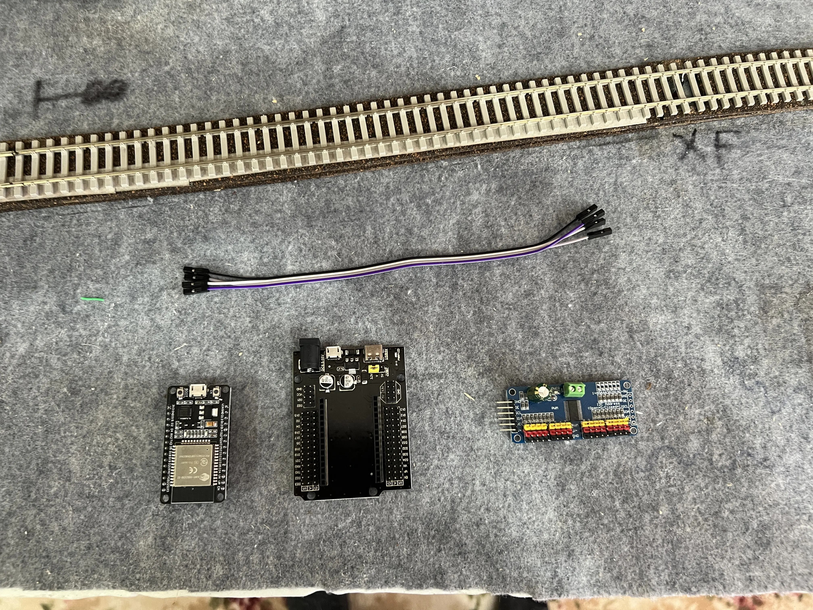
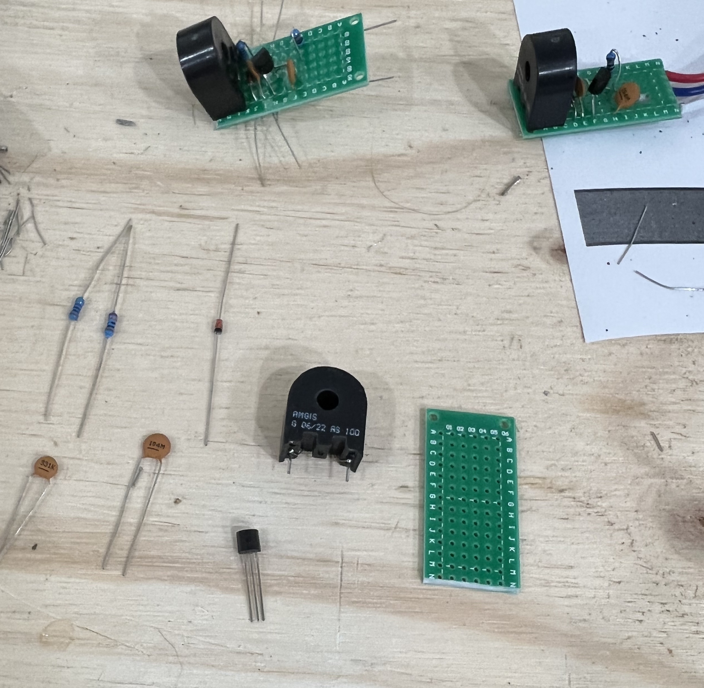
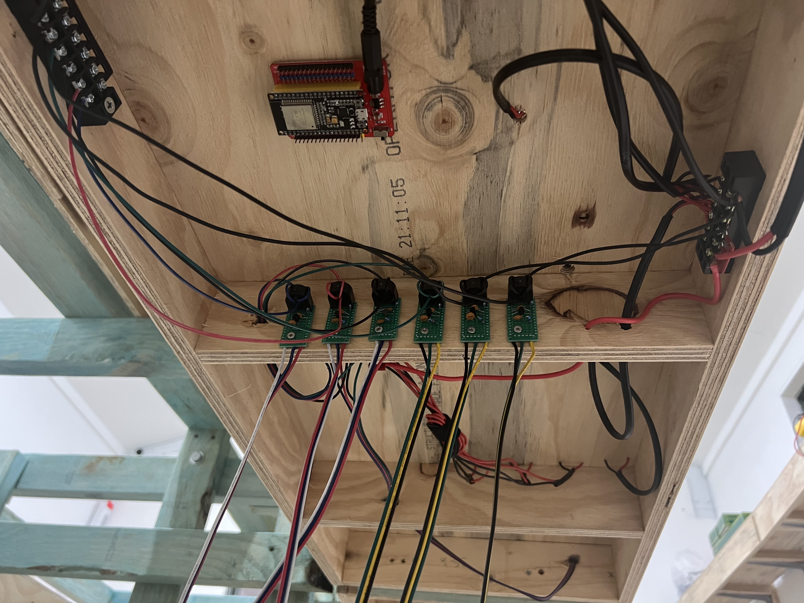

# ESPHome for Model Railroading

## Introduction

The repo is a collection of resources for using the home automation tool ESPHome with a model railroad. ESPHome is a great platform to base your automations/control systems on as it abstracts a lot of the authoring of code away from you, so you can focus on creating something that works for your use case, and know that the code running on your microcontrollers is optimised.

If you are new to all of this, start here first:

1. **[Set up your PC](installing-esphome-cheatsheet.md)** — install Docker Desktop, start MQTT and ESPHome Dashboard.
2. **[Configure your first board](first-board-setup-guide.md)** — create a device, flash it by USB, confirm it is online.
3. **[Get help from Copilot](copilot-steering-prompts.md)** — copy-paste prompts to guide you through any step.

Currently I'm working on the following 3 use cases:

- Block Detection
- Point Control
- Signal Control

## Background

My layout is based on the Illawarra line in the early 2000's between Bomaderry/Nowra, Kiama and other areas of interest. Here's a [website](https://illawarraline.net) with some more info.

As I'm building the layout for operations, having a central control system was of utmost importance. I've previously used propietary systems such as Train-Brain by CTI Electronics, which I implemented on a [previous N Scale layout](https://steinosub.blogspot.com) and this worked quite well.

Since my discovery of Arduino and by extension ESP32/ESP8266 boards I've been trying to find a way to use them for block detection. I've done a couple of basic POCs using Arduino/Micropython ([here](https://github.com/aaron9589/block-detection-poc) and [here](https://github.com/aaron9589/IoCATS)).

## Control System

I've settled on using JMRI as the backbone for this control system purely for its [MQTT integration](https://www.jmri.org/help/en/html/hardware/mqtt/index.shtml). I'm using the CATS add-on, which simplies some of the signalling logic I'd have to implement. I highly recommend the [herding cats](https://www.youtube.com/watch?v=H-P1guhnVpw&list=PLfmcarbF8DzEG9taeiSSWonbz3h6VQs3F) YouTube series, if you want learn more about CATS straight from the folks that help support it

CATS talks to JMRI through tables - and those tables are reflected through MQTT topics. This is the key integration that allows the use of ESPHome on a layout.

## Setting Up Your First ESP Board in ESPHome

### Components

Everything except the transformers I source from AliExpress. For the PCA/dupont connectors, do a search and find the cheapest one you can find.



- ESP32, CP2102 and matching board: https://www.aliexpress.com/item/1005004337178335.html
- PCA9685 Boards
- 20cm Female-Female Dupont Connectors
- 2x 6-12v Transformers. I run two buses - one for the ESP at 6.5v and one for Servos at 5v. The 6.5v is dropped to 5v by the breakout boards. I could use Buck Converters off the DCC Bus, but I wanted to keep this completely seperate to preserve the signal/servo state in the event of a short in a power district.

So you've ordered the bits, waited that arbitrary amount of time for it to materialise at your doorstep - now what?

### Setup the supporting infrastructure

To use ESPHome, you require:

- A 2.4Ghz (not 5Ghz) Wifi network your ESPs can join with DHCP (most modem/routers have these capabilities out of the box, I use a standalone Unifi Access Point cabled to my core network)

- A computer (obviously) - if you have a computer with JMRI installed already - thats a good place to start.

- Docker Desktop to install ESPHome and (optionally) an MQTT Broker — follow the [setup cheatsheet](installing-esphome-cheatsheet.md) for step-by-step instructions on a Windows PC.

- Note down your computer's IP address, and your Wifi network Name and password - you'll need it shortly.

Once your PC is set up, follow [first-board-setup-guide.md](first-board-setup-guide.md) to create your first device, flash it by USB, and confirm it is online.

## Setting Up Block Detection

I've used the *DCC Track Occupancy Transistor-based Current Detection Circuit - Revised* from [sumidacrossing.org](http://sumidacrossing.org/LayoutControl/TrainDetection/InductiveDetectionCircuit/) as a block detector that feeds into ESPHome. The article has a good write up about various detectors and their pros/cons. I chose this one since it easily integrates with an Arduino/ESP input pin, and the components required end up costing ~$5 per sensor which isn't bad value.

As per the article I sourced the current sensors (AS-100) from Digikey - the other components are easily sourced from your favourite electronics supplier. In addition, the Prototype Board for the Current Detector modules are availble at AliExpress https://www.aliexpress.com/item/32923792538.html - these boards are split lengthways and two block detectors are made from each.





### Additional Detector Notes

- Blocks are highly variable and will require tuning. Don't wire them all at once and test because you'll most likely need to make changes! (I speak from experience here)
- The coil is quite sensitive. Try with the coil straight through before adding additional windings.
- Plug the detector straight into the running ESP. Ensure there is nothing on the track. If it flicks straight to occupied with nothing on the track, reduce the number of windings.
  - If it detects nothing when a load is placed on the track, try adding additional windings.
  - If you can't maintain the two states without modifying the winding - reset back to a single wire through the coil, and add a 10K potentiometer (something like [this](https://www.jaycar.com.au/10k-ohm-linear-b-single-gang-9mm-potentiometer/p/RP8510)) across the two ends of the detector coil on the board for finer adjustment.

### Integration with ESPHome

_Assumes you have followed the cheatsheet and have ESPHome Dashboard and EMQX running, and completed [first-board-setup-guide.md](first-board-setup-guide.md)._

1. Copy [samples/my-first-board/modules/block_detectors.yaml](samples/my-first-board/modules/block_detectors.yaml) into the `modules/` folder in your ESPHome config.
2. Edit the `substitutions` section at the top to match your block names and MQTT topics.
3. The include is already in the sample `board.yaml` — make sure the `sensors:` line is uncommented:
   ```yaml
   packages:
     sensors:  !include modules/block_detectors.yaml
   ```
4. Click **Install > Wireless** to push the update over Wi-Fi.
5. Wire your block detector and place a train on the track. Check the ESPHome logs — you should see `OCCUPIED` / `UNOCCUPIED` messages and the MQTT topic will change.

**Need CATS train-describer direction handling?** Add [samples/advanced-samples/end_of_block.yaml](samples/advanced-samples/end_of_block.yaml) as a second package for each block that needs it.

## Setting Up Point Control

[samples/my-first-board/modules/point_control.yaml](samples/my-first-board/modules/point_control.yaml) drives servos via a **PCA9685 PWM driver board**, which lets you control up to 16 servos from a single ESP32 over I2C. The PCA9685 V+ rail must be powered from a dedicated 5V supply — not from the ESP32.

1. Copy `point_control.yaml` into the `modules/` folder in your ESPHome config and edit the substitutions (turnout name, MQTT topic, PCA9685 channel).
2. The include is already in the sample `board.yaml` — make sure the `points:` line is uncommented:
   ```yaml
   packages:
     points:   !include modules/point_control.yaml
   ```
3. Install wirelessly. Open `http://<board-name>.local` in Chrome or Edge — you will see the calibration sliders.
4. Use the sliders to find the normal and reverse endpoints for each servo. Values are saved to the ESP automatically.
5. Mount the servo centred, then fine-tune endpoints.
6. Send `CLOSED` or `THROWN` to the turnout's MQTT topic to confirm the point moves.

**Ground throws (manual levers)?** Use [samples/advanced-samples/ground_throws.yaml](samples/advanced-samples/ground_throws.yaml) to read physical lever inputs and publish the same MQTT topics. Includes optional signal interlocking.

## Setting up Signals

Signals use [WLED](https://kno.wled.ge) running on a second ESP to drive WS2812B LED signal heads over a serial link.

- [samples/advanced-samples/wled_signal.yaml](samples/advanced-samples/wled_signal.yaml) subscribes to CATS signal mast topics and sends JSON commands to WLED. Open the file — the comments at the top explain the WLED segment/LED layout and how to match aspects to your prototype signals.
- See https://illawarraline.net/signals-for-the-illawarra-line/ for the full hardware build.

## Sample Files

The [samples](samples) folder is split into two areas.

### Start here — my-first-board/

Three files that work together. The `board.yaml` is your main config; `block_detectors.yaml` and `point_control.yaml` go in a `modules/` subfolder next to it in your ESPHome config.

| File | Purpose |
|---|---|
| [my-first-board/board.yaml](samples/my-first-board/board.yaml) | Main board file — Wi-Fi, MQTT, OTA, and feature file includes |
| [my-first-board/modules/block_detectors.yaml](samples/my-first-board/modules/block_detectors.yaml) | Train detection in track blocks via current detector |
| [my-first-board/modules/point_control.yaml](samples/my-first-board/modules/point_control.yaml) | Servo-driven turnout control via PCA9685 |
| [secrets.yaml](samples/secrets.yaml) | Template for Wi-Fi and MQTT credentials |

### Advanced components — advanced-samples/

These add more capability once your first board is working.

| File | Purpose |
|---|---|
| [advanced-samples/sample_board_config.yaml](samples/advanced-samples/sample_board_config.yaml) | Board template with random boot delay (multi-board layouts) |
| [advanced-samples/end_of_block.yaml](samples/advanced-samples/end_of_block.yaml) | EOB sensors for CATS train-describer direction handling |
| [advanced-samples/ground_throws.yaml](samples/advanced-samples/ground_throws.yaml) | Physical lever inputs publishing turnout MQTT topics |
| [advanced-samples/wled_signal.yaml](samples/advanced-samples/wled_signal.yaml) | WS2812B signal heads via WLED + UART serial |
| [advanced-samples/bellcodes.yaml](samples/advanced-samples/bellcodes.yaml) | Railway bell code audio via DFPlayer Mini |
| [advanced-samples/staff_machine.yaml](samples/advanced-samples/staff_machine.yaml) | RFID staff token machine for single-line working |

Each file is commented to explain what to change and how to add more instances.  

---

## Questions? Comments?

If you have any questions about this repo, want to help contribute to make the doco better, or just have a question about how to get it working - please raise an issue and I will try and assist where I can. Thanks for reading!
