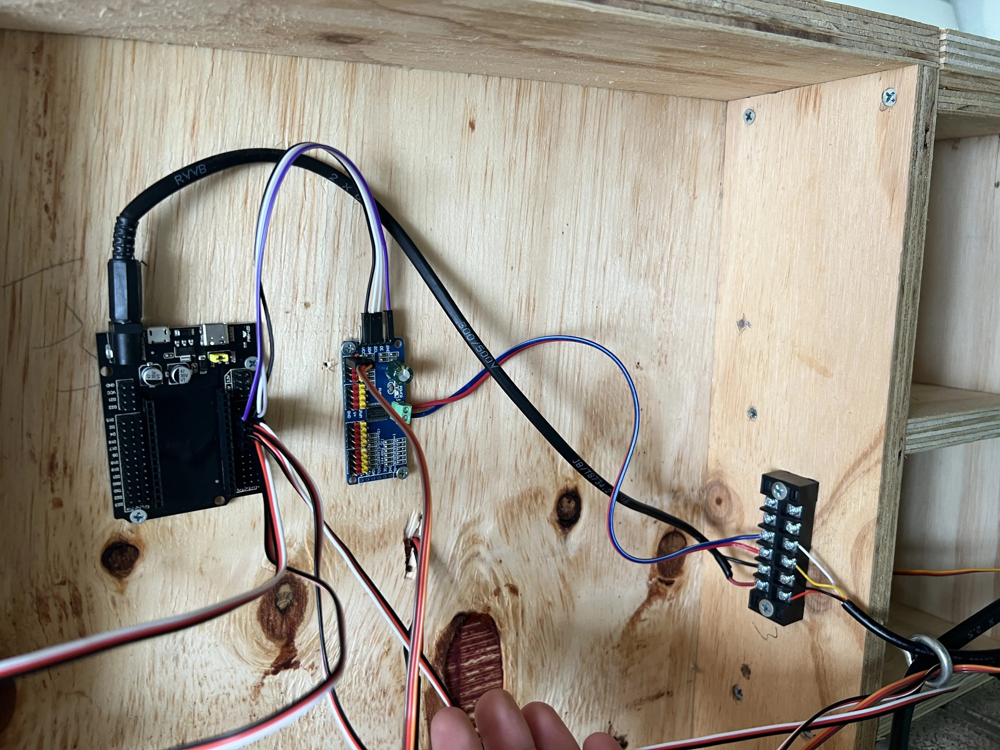

# ESPHome for Model Railroading

## Introduction

The repo is a collection of resources for using the home automation tool ESPHome with a model railroad. ESPHome is a great platform to base your automations/control systems on as it abstracts a lot of the authoring of code away from you, so you can focus on creating something that works for your use case, and know that the code running on your microcontrollers is optimised.

Currently I'm working on the following 3 use cases:

- Block Detection
- Point Control
- Signal Control

## Background

My layout is based on the Illawarra line in the early 2000's between Bomaderry/Nowra, Kiama and other areas of interest. Here's a [website](https://illawarraline.net) with some more info.

As I'm building the layout for operations, having a central control system was of utmost importance. I've previously used propietary systems such as Train-Brain by CTI Electronics, which I implemented on a [previous N Scale layout](https://steinosub.blogspot.com) and this worked quite well.

Since my discovery of Arduino and by extension ESP32/ESP8266 boards I've been trying to find a way to use them for block detection. I've done a couple of basic POCs using Arduino/Micropython ([here](https://github.com/aaron9589/block-detection-poc) and [here](https://github.com/aaron9589/IoCATS)).

## Control System

I've settled on using JMRI as the backbone for this control system purely for its [MQTT integration](https://www.jmri.org/help/en/html/hardware/mqtt/index.shtml). I'm using the CATS add-on, which simplies some of the signalling logic I'd have to implement. I highly recommend the [herding cats](https://www.youtube.com/watch?v=H-P1guhnVpw&list=PLfmcarbF8DzEG9taeiSSWonbz3h6VQs3F) YouTube series, if you want learn more about CATS straight from the folks that help support it

CATS talks to JMRI through tables - and those tables are reflected through MQTT topics. This is the key integration that allows the use of ESPHome on a layout.

## Setting Up Your First ESP Board in ESPHome

### Components

Everything except the transformers I source from AliExpress. For the PCA/dupont connectors, do a search and find the cheapest one you can find.


- ESP32, CP2102 and matching board: https://www.aliexpress.com/item/1005004337178335.html
- PCA9685 Boards
- 20cm Female-Female Dupont Connectors
- 2x 6-12v Transformers. I run two buses - one for the ESP at 6.5v and one for Servos at 5v. The 6.5v is dropped to 5v by the breakout boards. I could use Buck Converters off the DCC Bus, but I wanted to keep this completely seperate to preserve the signal/servo state in the event of a short in a power district.

So you've ordered the bits, waited that arbitrary amount of time for it to materialise at your doorstep - now what?

### Setup the supporting infrastructure

To use ESPHome, you require:

- A 2.4Ghz (not 5Ghz) Wifi network your ESPs can join with DHCP (most modem/routers have these capabilities out of the box, I use a standalone Unifi Access Point cabled to my core network)

- A computer (obviously) - if you have a computer with JMRI installed already - thats a good place to start.

- Docker Desktop to install ESPHome and (optionally) an MQTT Broker - follow the [Cheatsheet](/installing-esphome-cheatsheet.md) which details this further for a windwos PC.

- Note down your computer's IP address, and your Wifi network Name and password - you'll need it shortly.

### Setup ESPHome Dashboard

If you're not familiar with Docker or Python, this will be a bit tricky. In short, you need to setup a copy of ESPHome to run the dashboard - this makes it easy to see all your configured boards in one spot, and make any changes over the wifi once the board is registered in the dashboard. More details on the dashboard can be found [here](https://esphome.io/guides/getting_started_command_line.html#bonus-esphome-dashboard). However, the [Cheatsheet](/installing-esphome-cheatsheet.md) shows how you can deploy the dashboard using Docker Desktop on a windows PC. Have a read of that article, and come back here once you've setup ESPHome and (optionally) EMQX.

If your container has started, navigate to http://localhost:6052 and you'll see something like this:


Success! you are ready to configure your first board.

### Configure Your First ESPHome Board

Refer to the [Cheatsheet](/installing-esphome-cheatsheet.md) which goes through this in more detail.

## Setting Up Block Detection

I've used the *DCC Track Occupancy Transistor-based Current Detection Circuit - Revised* from [sumidacrossing.org](http://sumidacrossing.org/LayoutControl/TrainDetection/InductiveDetectionCircuit/) as a block detector that feeds into ESPHome. The article has a good write up about various detectors and their pros/cons. I chose this one since it easily integrates with an Arduino/ESP input pin, and the components required end up costing ~$5 per sensor which isn't bad value.

As per the article I sourced the current sensors (AS-100) from Digikey - the other components are easily sourced from your favourite electronics supplier. In addition, the Prototype Board for the Current Detector modules are availble at AliExpress https://www.aliexpress.com/item/32923792538.html - these boards are split lengthways and two block detectors are made from each.




### Additional Detector Notes

- Blocks are highly variable and will require tuning. Don't wire them all at once and test because you'll most likely need to make changes! (I speak from experience here)
- The coil is quite sensitive. Try with the coil straight through before adding additional windings.
- Plug the detector straight into the running ESP. Ensure there is nothing on the track. If it flicks straight to occupied with nothing on the track, reduce the number of windings.
  - If it detects nothing when a load is placed on the track, try adding additional windings.
  - If you can't maintain the two states without modifying the winding - reset back to a single wire through the coil, and add a 10K potentiometer (something like [this](https://www.jaycar.com.au/10k-ohm-linear-b-single-gang-9mm-potentiometer/p/RP8510)) across the two ends of the detector coil on the board for finer adjustment.

### Integration with ESPHome

_These Steps assume you have followed the cheatsheet to configure your ESPHome and EMQX/MQTT Broker, and you're fairly confident with using the board_

So you've built your first board. Now we're going to get it integrated with ESPHome, detect a train on your track, and feed this information back to MQTT. We are going to use the samples in this Repo to help make that easier.

1. Create a folder the same name of your board where your current YAML config file is (Remember the WSL Path in the [Cheatsheet!](/installing-esphome-cheatsheet.md). You can call the folder whatever you like, but for consistencies sake the board name will do.

2. Make a copy of gpio_01.yaml in the samples folder of this repo, and place it into the folder you created. Review the comments so you have an idea on what its doing.

3. In your boards main YAML file, you will need to add the following:

   ```yaml
   packages:
     gpio: !include <your-board-folder>/gpio_01.yaml
   ```
   Rename the `sta-bd-01` section to the name of the folder you created.

   *Hint - you can reference as many files as you like using this method - just make sure the left hand side of the colon (gpio:) is unique, eg gpio2: gpio3: etc.*

5. Open your ESPHome Dashboard - click edit on your board, then click install and select wireless. Your board now that you've uncommented the line in step 3 will recompile and push the updated config over WiFi to the board.
6. You can now hook up your sensor, loop your track through the current detector, and place a train on the track. If it's all worked, you'll see a log on your ESPHome Dashboard indicating this, and your MQTT topic will change.

## Setting Up Point Control

I've used SG90 servos on my layout, have previously used them with Tam Valley Singlets and they work well. 

There are two files in this repo that will allow you to start using your ESP to control servos for point motor control, further instructions are below.

1) Make a copy of servos_01.yaml and move to your device folder.
2) Add the following block to your devices yaml file:
   ```yaml
   packages:
     gpio: !include <your-board-folder>/servos_01.yaml
   ```
4) Follow the comments in each file, and configure your ESP for your first servo. Upload and reboot your ESP.
5) Plug in your servo to the same pin defined in the YAML file.
6) navigate to your devices new web server (eg http://<my-device-name>.local) - a web page will come up.
7) Select the slider, and press the left or right arrow key. The console will update with the new value. Press the key until you are back at 0.0
8) Your servo is now centred - mount your servo in your XOver with the tie bar centered between the rails.
9) Move the slider again and update the normal/backoff values. These will save to the ESP.
10) Test by changing your MQTT topic for the servo to CLOSED or THROWN (either manually or through something like JMRI/CATS) - confirm the point changes.

## Adding other useful components

`` the [samples](/samples/sample_board_config.yaml) contains a couple of other useful things you may want to use.

- A random delay, that helps to spread the load of all the devices starting at once on your network.
- A button and MQTT topic for resetting the ESP Device.
- Some other config that i've tried to add comments in for as to why its there.
  
## Setting up Signals

The signalling i've chosen is a little more complex, as I'm using [WLED](https://kno.wled.ge) to control custom LEDs.

I've detailed this more on my blog, https://illawarraline.net/signals-for-the-illawarra-line/  

---

## Questions? Comments?

If you have any questions about this repo, want to help contribute to make the doco better, or just have a question about how to get it working - please raise an issue and I will try and assist where I can. Thanks for reading!
